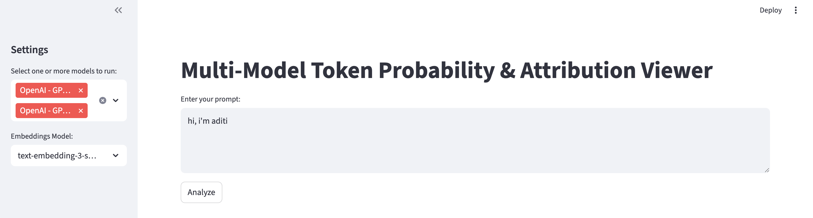

# TokenSHAP: Interpreting Large Language Models

TokenSHAP is a model-agnostic interpretability frameworks for large-scale AI systems. It's grounded in Monte Carlo Shapley value estimation, enabling detailed attribution of importance to individual parts of the input—**tokens in text**. **This website** was created to see that firsthand, to be able to input a prompt and compare how different models analyze that prompt. 

## Overview

- **TokenSHAP** explains the output of large language models (LLMs) by computing Shapley values for input tokens. It estimates how much each token contributes to the final model response. This website visualizes those values for any prompt. You can also select multiple models and compare their Shapley values and overall similarity, side by side.


---

## 🔍 TokenSHAP

TokenSHAP provides fine-grained interpretability for language models using Monte Carlo Shapley value estimation over input tokens.


### Key Features
- Estimates token importance using cooperative game theory
- Highlights which parts of a prompt contributed most to the generated response
- Compatible with both local and API-based LLMs
- Can compare OpenAI, HF, & Llama Models (HF not reccomended to run locally due to high compute)


### Example Usage of TokenSHAP
```python
from token_shap import *

model = LocalModel("meta-llama/Llama-3.2-3B-Instruct")
splitter = StringSplitter()
token_shap = TokenSHAP(model, splitter)

prompt = "Why is the sky blue?"
df = token_shap.analyze(prompt, sampling_ratio=0.0, print_highlight_text=True)
```

For API-based models:
```python
api_model = OllamaModel(model_name="llama3.2:3b", api_url="http://localhost:11434")
token_shap_api = TokenSHAP(api_model, StringSplitter())
df = token_shap_api.analyze("Why is the sky blue?", sampling_ratio=0.0)
```


### How to Use the Website
1. Choose LLMs, embeddings models, and enter a prompt.
   
   
2. Visualize results for each LLM, seeing which tokens are most important.
   
   
3. Compare how models prioritize tokens to a default reference model.
   
   
4. See how similar the models are overall.

   

## 🧪 Installation

To get started, clone the repository and install the dependencies:

```bash
git clone https://github.com/aditibordia/tokenSHAPwebsite.git
cd TokenSHAP
pip install -r requirements.txt
streamlit run app.py
```

*Note: PyPI installation is currently disabled.*

## 🚨 Caution
Here are some things to know before proceeding:
- Long prompts take a WHILE to run. The longer a prompt is, the more tokens there are, therefore, the more combinations there are to run.
- HF models also take a while to run due to hardware limitations. It's reccomended to try any of the OpenAI or Llama models instead!

Have fun trying this out! Experiment with all kinds of prompts and see what results you get!
---

## 📄 Citation

Credits for TokenSHAP go to:

```bibtex
@article{goldshmidt2024tokenshap,
  title={TokenSHAP: Interpreting Large Language Models with Monte Carlo Shapley Value Estimation},
  author={Goldshmidt, Roni and Horovicz, Miriam},
  journal={arXiv preprint arXiv:2407.10114},
  year={2024}
}


---

## 👥 Authors of TokenSHAP

- **Roni Goldshmidt**, Nexar
- **Miriam Horovicz**, NI


